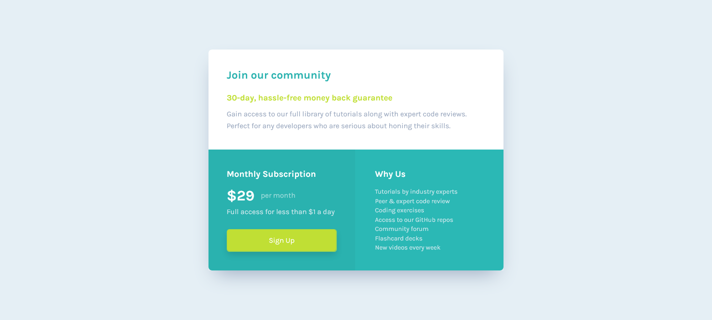

# ✨ Single Price Grid Component

Solução do [desafio](https://www.frontendmentor.io/challenges/single-price-grid-component-5ce41129d0ff452fec5abbbc) proposto pela plataforma Frontend Mentor.

---

## ✔️ Sumário

- [Visão geral](#-visão-geral)
  - [O desafio](#o-desafio-)
  - [Demonstração](#demonstração-%EF%B8%8F)
- [Desenvolvimento](#%EF%B8%8F-desenvolvimento)
  - [Construído com](#construído-com-)
- [Autor](#-autor)

---

## 🔎 Visão Geral

### O Desafio 🎯

Os usuários da aplicação devem ser capazes de:

- Visualizar um layout responsivo, que se adapta de acordo com o tamanho da tela do dispositivo utilizado; e
- Visualizar um efeito de hover no botão de Sign Up.

### Demonstração 🖥️

---

## 🕹️ Desenvolvimento

### Construído com 🔮

- [HTML5](https://devdocs.io/html/);
  - Semântica e estruturação; e
  - Utilização, até certo ponto (devido a algumas limitações impostas pelo próprio design), das melhores práticas para acessibilidade;
- [Tailwind CSS](https://tailwindcss.com/);
  - Integração com a biblioteca PostCSS;
  - Flexbox, animações 3D e efeitos de estado;
  - Utilização das diretivas @base, @components e @utilities;
  - Criação de tema personalizado e extensão do tema padrão;
  - Inclusão de estilos customizados dentro das layers do Tailwind com @layer;
  - Separação das classes utilitárias em arquivos de estilo, visando uma maior organização entre a estilização e a estrutura da página; e
  - Responsividade sob a óptica do desktop-first (ainda que esta não seja a abordagem padrão).
- [TypeScript](https://www.typescriptlang.org/);
  - Variáveis, parâmetros e retornos de função 100% tipados.
- [ReactJS](https://reactjs.org/);
  - Componentização do layout; e
  - Utilização das Propriedades para atribuição de valores dinâmicos para os Componentes.
- [Husky](https://typicode.github.io/husky/#/);
  - Interceptação de ações executadas pelo Git com os Git Hooks.
- [Commitizen](https://github.com/commitizen/cz-cli); e
  - Criação de mensagens de commit baseadas no [Conventional Changelog](https://github.com/conventional-changelog/conventional-changelog).
- [Commitlint](https://commitlint.js.org/#/).
  - Validação, anteriormente ao salvamento, das mensagens de commit.

---

## 👨🏽‍🎓 Autor

  

  

    <h3>
      🤝🏽 Thiago Raniery Brito
    </h3>
    

      E aí, Dev, gostou da solução? Bom, se quiser, fique à vontade para contribuir com sugestões, ou apenas entrar em contato comigo, por meio de qualquer uma das plataformas abaixo, até mais! 👋🏽
    

  

  
  

    
    
    
    
    
  

---
